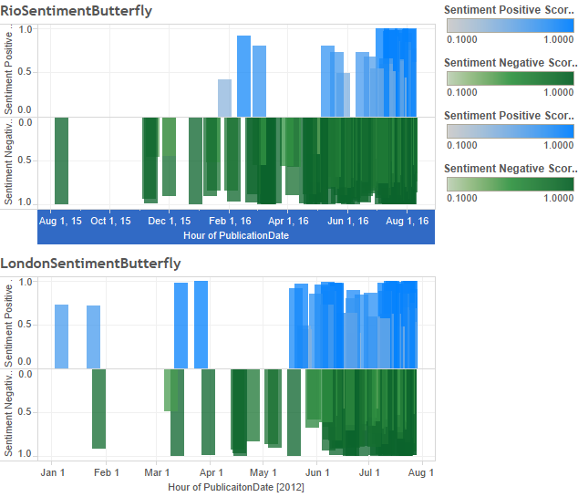

# London and Rio Olympic Sentiment Analysis

## Overview
The Rio Olympics appeared to have a constant barrage of negative media coverage leading up to the games. Media coverage included the impeachment of the president of Brazil, the Zika virus, the violence of the favelas, and water pollution at Olympic venues.

This analysis compares the sentiment of the Rio Olympics to the previous Summer games held in London. Close to two hundred articles from The Guardian were used to analyze the sentiment for each of the Summer Olympics. The cut off dates was the day before their respective opening ceremony. For Rio this was August 4 2016 and July 26 2012 for London. The sentiment analysis of the London Games was  additionally interesting considering that the Guardian is a British media outlet.

## Query
The Guardian is one of the very few newspapers that provide an API that returns the full text of their articles. A search for 'Rio Olympics' and 'London Olympics' with the cut off dates mentioned previously were used. The returned text articles were then cleaned since they contained HTML encoding.

##Sentiment
The content of the articles were then passed through [Rosette Sentiment Analysis opertator](https://marketplace.rapidminer.com/UpdateServer/faces/product_details.xhtml?productId=rmx_rosette_text_toolkit) within RapidMiner. Each article then returned a negative or positive score between 0 and 1. 

##Diagram
The sentiment scores were imported to Tableau to generate a butterfly diagram. The x-axis is time and the y-axis is the sentiment score. Blue bars are positive sentiments and green bars are negative sentiments.

An interactive version can be found at the following link: https://public.tableau.com/profile/aw1483#!/vizhome/GuardianRioLonSentimentButterfly/OlymSentimentButterfly

Looking at the results it may surprise some people of the amount of negative sentiment to the London Olympics. In fact, the negative results are comparable to Rio. 

# Environment
* RapidMiner
* Tableau